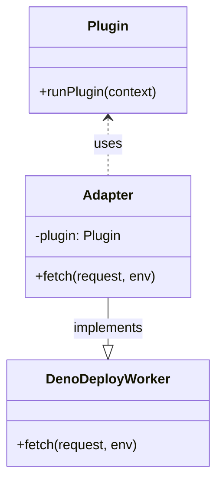

# System Patterns: Plugin Deployment Architecture

## Core Architectural Principles
1. **Separation of Concerns**:
   - Keep core application and plugins decoupled
   - Use adapters to bridge interface differences
   - Maintain plugin source integrity

2. **CI-Driven Adaptation**:
   - Perform all compatibility fixes in CI pipeline
   - Never modify plugin source code directly
   - Use automated scripts for transformations

3. **Immutable Deployments**:
   - Each commit generates a unique deployment
   - Previous deployments remain accessible
   - No in-place updates to live deployments

## Key Patterns

### Adapter Pattern

### CI Transformation Layer

### Deployment Pipeline
1. **Source Preparation**:
   - Checkout with submodules
   - Fix import extensions
   - Bundle plugin code

2. **Environment Setup**:
   - Filter sensitive variables
   - Generate .env file
   - Configure project settings

3. **Deployment Execution**:
   - Create/verify Deno project
   - Deploy worker script
   - Verify deployment status

## Best Practices

### Git Submodule Management
- Use recursive checkout in CI
- Pin submodules to specific commits
- Avoid modifying submodules directly
- Update submodules through PR process

### Deno Deployment
- Use auto-generated project names
- Include branch name in project identifier
- Separate production and preview deployments
- Use deployctl for deployment operations

### Error Handling
- Implement verification at each CI step
- Capture and log deployment errors
- Automatically retry transient failures
- Provide clear error messages in logs

## Critical Implementation Details
1. Import transformations must handle:
   - Relative paths
   - JSON imports
   - Different quote styles
   - File extensions

2. Environment variables must:
   - Exclude GitHub and system variables
   - Preserve plugin-specific configuration
   - Be passed via temporary .env file

3. Deployment must:
   - Verify project existence before deployment
   - Handle both personal and org projects
   - Support production and preview deployments
