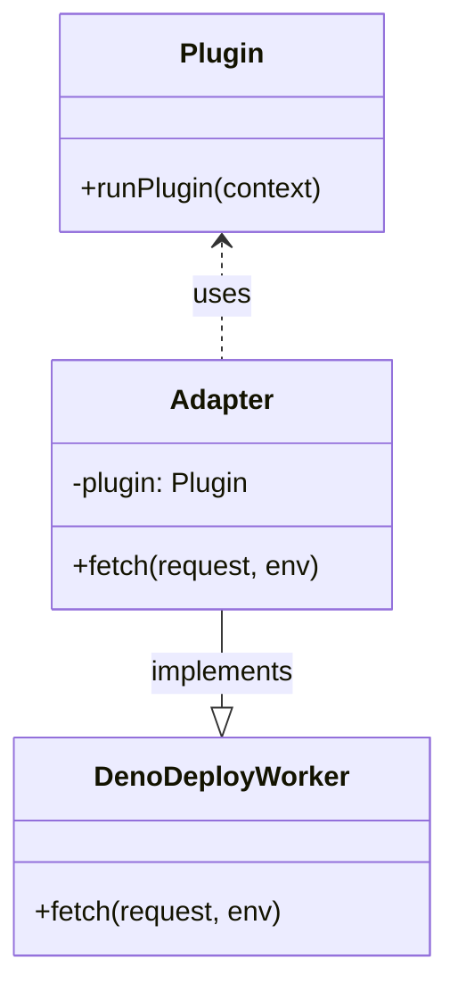

# System Patterns: Plugin Deployment Architecture

## Core Architectural Principles
1. **Separation of Concerns**:
   - Keep core application and plugins decoupled
   - Use adapters to bridge interface differences
   - Maintain plugin source integrity

2. **CI-Driven Adaptation**:
   - Perform all compatibility fixes in CI pipeline
   - Never modify plugin source code directly
   - Use automated scripts for transformations

3. **Immutable Deployments**:
   - Each commit generates a unique deployment
   - Previous deployments remain accessible
   - No in-place updates to live deployments

## Key Patterns

### Adapter Pattern

### CI Transformation Layer

### Deployment Pipeline
1. **Source Preparation**:
   - Checkout with submodules
   - Install Node.js dependencies (for types)
   - Create deno.json configuration

2. **Deno Configuration**:
   - Enable nodeModulesDir for compatibility
   - Allow sloppy imports
   - Enable node globals
   - Set appropriate compiler options

3. **Wrapper Creation**:
   - Use npm: specifiers for packages
   - Direct import of plugin worker
   - No bundling required
   - Leverage Deno's native compatibility

4. **Environment Setup**:
   - Filter sensitive variables
   - Generate .env file
   - Configure project settings

5. **Deployment Execution**:
   - Create/verify Deno project
   - Deploy with Deno entry point
   - Verify deployment status

## Best Practices

### Git Submodule Management
- Use recursive checkout in CI
- Pin submodules to specific commits
- Avoid modifying submodules directly
- Update submodules through PR process

### Deno Deployment
- Use auto-generated project names
- Include branch name in project identifier
- Separate production and preview deployments
- Use deployctl for deployment operations

### Error Handling
- Implement verification at each CI step
- Capture and log deployment errors
- Automatically retry transient failures
- Provide clear error messages in logs

## Critical Implementation Details
1. Deno compatibility approach:
   - Use npm: specifiers for npm packages
   - Use node: specifiers for Node.js built-ins
   - Enable nodeModulesDir in deno.json
   - Allow sloppy imports for flexibility

2. Configuration requirements:
   - deno.json with proper compiler options
   - Unstable features for full compatibility
   - Direct imports instead of bundling
   - Minimal wrapper code

3. Environment variables must:
   - Exclude GitHub and system variables
   - Preserve plugin-specific configuration
   - Be passed via temporary .env file

4. Deployment must:
   - Verify project existence before deployment
   - Handle both personal and org projects
   - Support production and preview deployments
   - Use native Deno features over workarounds
