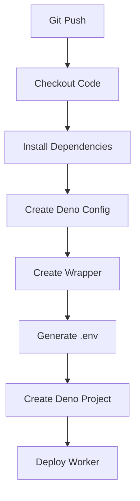

# Technical Context: Plugin Deployment Architecture

## System Overview
The system enables deployment of Deno-based plugins to Deno Deploy using GitHub Actions. Key components:
1. **Plugin Template**: Git submodule containing plugin code
2. **Adapter**: Converts plugin to Deno Deploy compatible worker
3. **CI Pipeline**: GitHub Actions workflow for building and deployment
4. **Deploy Scripts**: Reusable actions for Deno Deploy integration

## Deployment Process


## Key Technologies
- **Deno Deploy**: Serverless deployment platform
- **GitHub Actions**: CI/CD orchestration
- **Deno CLI**: Runtime and bundling tool
- **Git Submodules**: Plugin dependency management

## CI Pipeline Components
### Deno Configuration
- Creates deno.json with compatibility settings
- Enables nodeModulesDir for npm packages
- Allows sloppy imports and node globals
- Sets appropriate compiler options

### Plugin Wrapper
- Uses npm: specifiers for direct imports
- No bundling required
- Leverages Deno's native Node.js compatibility
- Minimal adapter code

### Deno Deploy Integration
- Creates projects with auto-generated names
- Handles both personal and organization deployments
- Uses `deployctl` for deployment operations
- Passes environment variables securely

## Adapter Pattern
The plugin adapter uses Deno's npm: specifiers to import the plugin directly:

```ts
// Import with npm: specifiers for Deno compatibility
import "npm:dotenv/config";
import { createPlugin } from "npm:@ubiquity-os/plugin-sdk@^3.1.4";
import { Manifest } from "npm:@ubiquity-os/plugin-sdk@^3.1.4/manifest";
import { LOG_LEVEL, LogLevel } from "npm:@ubiquity-os/ubiquity-os-logger@^1.4.0";

// Import the plugin's worker directly
import pluginWorker from "../plugins/plugin-template/src/worker.ts";

// Re-export the worker's fetch handler
export default pluginWorker;
```

## Environment Handling
- Filters sensitive environment variables
- Generates temporary .env file for deployment
- Preserves only necessary variables for runtime

## Best Practices
1. Keep plugins as submodules for separation
2. Never modify plugin source code directly
3. Use Deno's native Node.js compatibility features
4. Prefer npm: specifiers over bundling
5. Configure deno.json for maximum compatibility
6. Verify each step of the deployment process

## Deno Configuration
```json
{
  "compilerOptions": {
    "allowJs": true,
    "lib": ["deno.window"],
    "strict": false
  },
  "nodeModulesDir": true,
  "unstable": ["sloppy-imports", "node-globals"]
}
```
