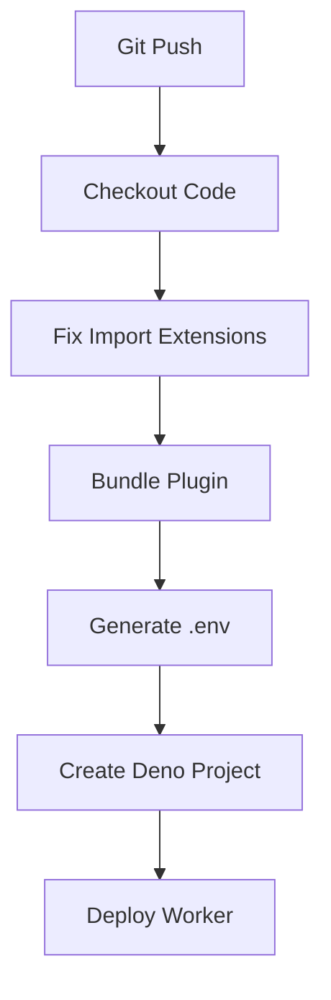

# Technical Context: Plugin Deployment Architecture

## System Overview
The system enables deployment of Deno-based plugins to Deno Deploy using GitHub Actions. Key components:
1. **Plugin Template**: Git submodule containing plugin code
2. **Adapter**: Converts plugin to Deno Deploy compatible worker
3. **CI Pipeline**: GitHub Actions workflow for building and deployment
4. **Deploy Scripts**: Reusable actions for Deno Deploy integration

## Deployment Process


## Key Technologies
- **Deno Deploy**: Serverless deployment platform
- **GitHub Actions**: CI/CD orchestration
- **Deno CLI**: Runtime and bundling tool
- **Git Submodules**: Plugin dependency management

## CI Pipeline Components
### Fix Import Extensions
- Automatically adds `.ts` extensions to imports
- Uses `sed` for in-place file modifications
- Handles JSON and other special imports

### Plugin Bundling
- Uses `deno bundle` with `--unstable-sloppy-imports`
- Generates single JavaScript file for deployment
- Verifies bundle existence before deployment

### Deno Deploy Integration
- Creates projects with auto-generated names
- Handles both personal and organization deployments
- Uses `deployctl` for deployment operations
- Passes environment variables securely

## Adapter Pattern
The plugin adapter acts as a bridge between Deno Deploy's worker interface and the plugin's expected context:

```ts
import { runPlugin } from './plugin-template-bundle.js';

export default {
  async fetch(request: Request, env: Record<string, unknown>) {
    // Create context object
    const context = { ... };

    try {
      await runPlugin(context);
      return new Response('OK');
    } catch (error) {
      return new Response('Error');
    }
  }
}
```

## Environment Handling
- Filters sensitive environment variables
- Generates temporary .env file for deployment
- Preserves only necessary variables for runtime

## Best Practices
1. Keep plugins as submodules for separation
2. Never modify plugin source code directly
3. Handle all adaptations in CI pipeline
4. Use automated scripts for compatibility fixes
5. Verify each step of the deployment process
